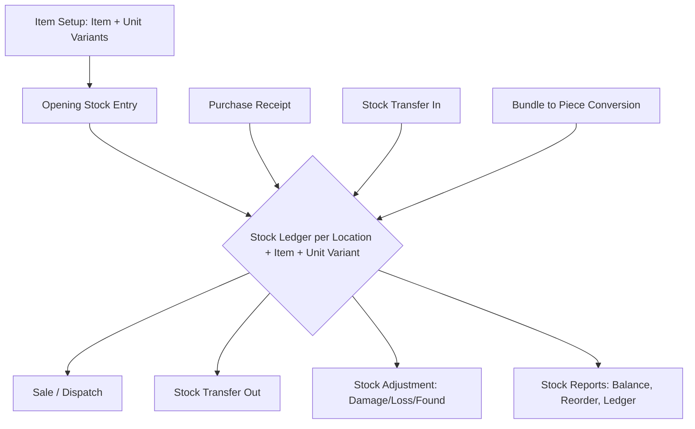
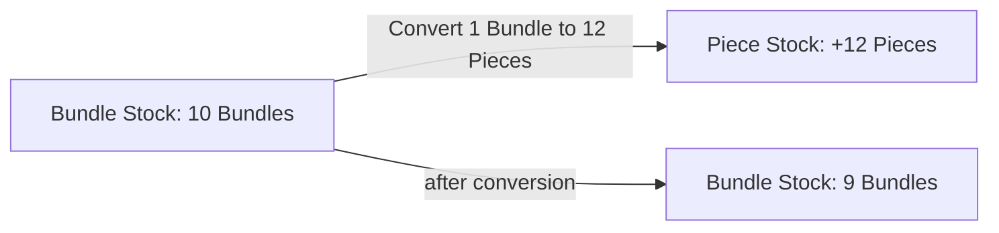
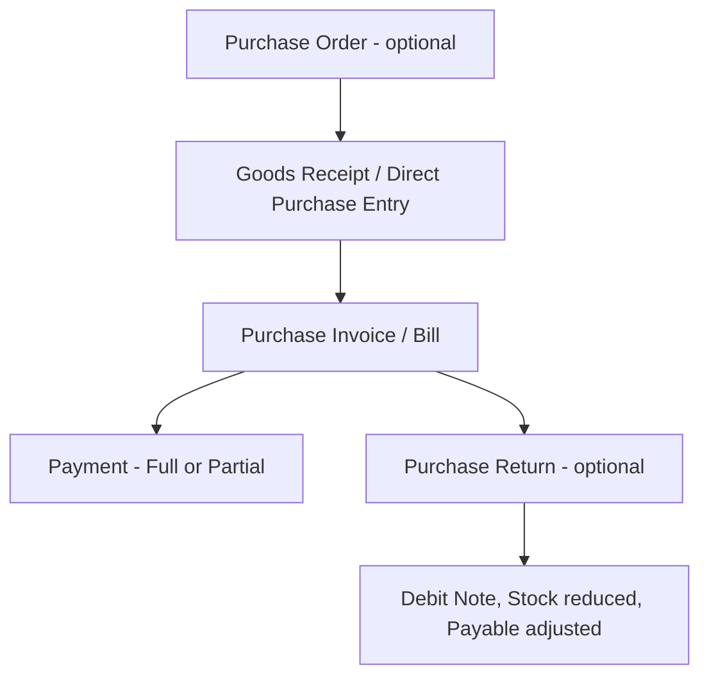
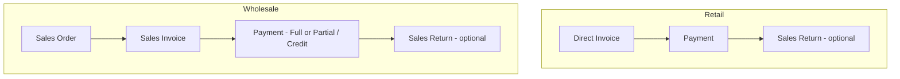

# Inventory Management Software — Functional Specification
**Modules covered:** Inventory, Purchase, Sales (+ shared Master Data)
**Business type:** Retail + Wholesale, Multi-location (Warehouse + Branches)
**Tax:** Dynamic tax engine (not hardcoded to GST, but configured to behave like GST out of the box)
**Version:** 1.0 (Draft for review) — **Date:** 2026-07-23

> 🚩 Wherever this document makes a default decision you haven't explicitly confirmed, it is marked **[ASSUMED DEFAULT]**. All of these are collected again in Section 9 — nothing here is final until you confirm it.

---

## 1. Overview

### 1.1 What this system does
One system to run:
- **Inventory** — stock across multiple locations, multiple unit types per item, bundle/loose tracking, transfers.
- **Purchase** — buying from suppliers, optional PO stage, payables with credit tracking.
- **Sales** — selling to retail and wholesale customers, receivables with credit tracking.

### 1.2 Core design decisions locked in from your answers

| Area | Decision |
|---|---|
| Business types | Retail + Wholesale, same system |
| Locations | Multi-location: Warehouse + Branches, with stock transfers between them |
| Units | Multiple unit types per item (kg, inch, piece, bundle...), reusable **Unit Library** |
| Bundle vs Piece | Tracked as **independent stock**, manually linked via a **Convert** action |
| Batch/Serial/Expiry | **Optional, per-item toggle** — off by default, turned on for items that need it |
| Bundle pricing | Auto-calculated from base unit price, **override allowed** |
| Sales flow | Retail = Direct Invoice. Wholesale = Order → Invoice |
| Purchase flow | **Optional** PO stage — can skip straight to a purchase entry |
| Credit | Full tracking both ways: Customer receivables AND Supplier payables (outstanding, due dates, partial payments) |
| Returns | Sales Returns and Purchase Returns, both in scope |
| Stock-out control | Configurable per item **and** per location — allow or block selling below zero |
| Access control | Role-based — Admin sees all locations, Branch Staff restricted to their own |
| Discounts | Both item-level and invoice-level |
| Tax | Dynamic tax engine — HSN/SAC, CGST/SGST/IGST split, but built as configurable "Tax Groups," not hardcoded |

---

## 2. Master Data (build these first — everything else depends on them)

### 2.1 Unit Library
A reusable set of units, defined once, attached to any item. Two kinds of units:

- **Base Unit** — the smallest tracked unit for that item (e.g. Piece, Kg, Meter, Inch).
- **Derived Unit** — a multiple of a base unit (e.g. "Bundle of 12" = 12 × Piece).

| Field | Type | Notes |
|---|---|---|
| Unit Code | Text | e.g. `PCS`, `BDL12`, `KG` |
| Unit Name | Text | e.g. "Piece", "Bundle of 12", "Kilogram" |
| Unit Kind | Base / Derived | |
| Base Unit Reference | Link (if Derived) | Which base unit this is built from |
| Conversion Factor | Decimal (if Derived) | e.g. 12 |
| Allow Decimal Qty | Yes/No | No for Piece/Bundle, Yes for Kg/Meter/Inch |

**Business rules**
- A unit is created once in the library and reused across any number of items (recommended, per your choice).
- "Allow Decimal Qty" is a unit-level property, so it doesn't need to be re-decided per item — Kg is always decimal, Piece is always whole, etc.

---

### 2.2 Item Master

| Field | Type | Notes |
|---|---|---|
| Item Code | Text | Auto or manual |
| Item Name | Text | |
| Category / Brand | Text | For filtering/reporting |
| HSN/SAC Code | Text | Feeds the dynamic tax engine |
| Tax Group | Link → Tax Group (2.3) | |
| Track Batch/Serial/Expiry | Toggle | Off by default (2.4) |
| Default Reorder Level | Number | Can be overridden per location |
| Stock-out Rule | Inherit Location / Allow / Block | See 3.3 for precedence |

**Unit Variants (sub-table on the Item)**
Each item can have **more than one stocking unit**, and each is tracked as **independent stock**.

| Field | Type | Notes |
|---|---|---|
| Unit | Link → Unit Library | e.g. Piece, Bundle of 12 |
| Is Base Price Unit | Yes/No | One variant is the "anchor" for pricing |
| Selling Price | Number | Auto = Base Price × Conversion Factor, editable |
| Purchase Price | Number | Same auto-calc + override logic |
| Price Manually Overridden | Yes/No (system-set) | Prevents silent overwrite when base price changes later — **[ASSUMED DEFAULT]** |

**Example — Iron Rod:**
| Unit | Conversion | Selling Price | Stock |
|---|---|---|---|
| Piece (base) | 1 | ₹120 | Tracked independently |
| Bundle of 12 | 12 | ₹1,440 (auto, editable) | Tracked independently |

---

### 2.3 Tax Group (Dynamic Tax Engine)

Instead of hardcoding "GST," the system has a generic **Tax Group** made of one or more **Tax Components**.

| Field | Type | Notes |
|---|---|---|
| Tax Component | Text | e.g. CGST, SGST, IGST — or any other name later |
| Rate % | Decimal | |
| Tax Group | Combination of components | e.g. "GST 18%" = CGST 9% + SGST 9% |

**Business rule (GST-style logic, since that's what you're likely to configure):**
- If Customer/Supplier State = Business Location State → apply **CGST + SGST**.
- If different state → apply **IGST** (same total rate, single component).
- This state-comparison logic only fires for Tax Groups marked "GST-type"; other tax groups (or "No Tax") just apply flat — keeping it dynamic rather than GST-only.

Each item is linked to one Tax Group via its HSN/SAC code, so if rates change, you edit the Tax Group once — not every item.

---

### 2.4 Batch / Serial / Expiry (Optional, per item)
Only turned on for items that need it (medicines, food, warranty goods).

| Field | Type | Notes |
|---|---|---|
| Batch/Serial No | Text | |
| Mfg Date | Date | Optional |
| Expiry Date | Date | Optional |
| Qty in Batch | Number | Tracked per location |

If off, the item behaves as plain stock with no batch-level detail.

---

### 2.5 Location Master

| Field | Type | Notes |
|---|---|---|
| Location Code / Name | Text | |
| Type | Warehouse / Branch | |
| State | Text | Needed for tax determination |
| Default Stock-out Rule | Allow / Block | Location-level default (3.3) |
| Manager | Link → User | |

**Stock Transfer** (between any two locations)
| Field | Type |
|---|---|
| Transfer No | Auto |
| From Location / To Location | Link |
| Items + Qty + Unit Variant | Table |
| Status | Draft → In-Transit → Received |

Stock leaves "From" on dispatch, enters "To" only on confirmed receipt — so stock in transit is visible but not double-counted.

---

### 2.6 Customer Master
| Field | Type |
|---|---|
| Customer Code / Name | Text |
| Type | Retail / Wholesale |
| GSTIN | Optional |
| Billing State | Text (for tax) |
| Credit Limit | Number |
| Credit Days | Number |
| Opening Balance | Number |

### 2.7 Supplier Master
Same structure as Customer, for payables instead of receivables.

### 2.8 Roles
For this round: **Admin** (all locations, all modules) and **Branch Staff** (restricted to their assigned location, all modules within it). More granular roles (Accountant, Sales-only, etc.) can be added later without restructuring this.

---

## 3. Inventory Module

### 3.1 Flow

**Bundle ↔ Piece conversion flow**

### 3.2 Screens & Fields

**Stock Ledger (view/report)**
Filters: Location, Item, Unit Variant, Date Range, Batch (if applicable).
Columns: Date, Transaction Type, Ref No, In Qty, Out Qty, Balance.

**Stock Adjustment**
| Field | Type |
|---|---|
| Location | Link |
| Item + Unit Variant | Link |
| Adjustment Qty (+/-) | Number |
| Reason | Damage / Loss / Found / Correction |
| Remarks | Text |

**Bundle Conversion Screen**
| Field | Type |
|---|---|
| Item | Link |
| Source Unit Variant | e.g. Bundle of 12 |
| Qty to Convert | Number |
| Destination Unit Variant | e.g. Piece (auto-filled from conversion factor) |
| Resulting Qty | Auto = Qty × Factor |
| Location | Link |

Reverse direction (assembling loose pieces back into a bundle) is available as the same screen run in reverse — **[ASSUMED DEFAULT: allowed, since physical repacking is plausible in your business; tell me if this should be blocked]**.

### 3.3 Business Rules

- Stock is tracked at the level of **Location + Item + Unit Variant** (+ Batch, if enabled). Bundle and Piece are never auto-derived from each other — only the Convert action moves stock between them, and it is logged as its own transaction type.
- **Stock-out rule precedence:** Item-level setting overrides Location-level default if explicitly set on the item; otherwise the Location's default applies.
- Reorder alerts fire per Item per Location, using the Item's default reorder level (overridable per location).
- **Stock valuation method** — not yet discussed. **[ASSUMED DEFAULT: Weighted Average Cost]**, since it's simpler to maintain across bundle/piece conversions than FIFO batch-tracking. Flag if you want FIFO instead — it changes how conversion cost is calculated.

---

## 4. Purchase Module

### 4.1 Flow

### 4.2 Screens & Fields

**Purchase Order** (optional stage)
| Field | Type |
|---|---|
| PO No | Auto |
| Supplier | Link |
| Location | Link |
| Expected Date | Date |
| Items | Item, Unit Variant, Qty, Rate |
| Status | Draft / Sent / Partially Received / Received / Cancelled |

**Goods Receipt / Direct Purchase Entry**
Can start from a PO or be created directly with no PO.
| Field | Type |
|---|---|
| Linked PO | Optional |
| Supplier, Location, Date | |
| Items received | Item, Unit Variant, Qty, Rate |
| Batch/Serial/Expiry | Captured here, if item requires it |
| Stock effect | Stock-in posted immediately on save |

**Purchase Invoice / Bill**
| Field | Type |
|---|---|
| Supplier Invoice No | Text |
| Linked Goods Receipt(s) | Link |
| Items, Tax Group per item | CGST/SGST/IGST auto-split |
| Item-level Discount | % or flat |
| Invoice-level Discount | % or flat |
| Due Date | Auto = Invoice Date + Supplier Credit Days, editable |
| Status | Unpaid / Partially Paid / Paid |

**Payment Entry (Supplier)**
| Field | Type |
|---|---|
| Supplier | Link |
| Invoice(s) applied against | One payment can split across multiple invoices |
| Amount, Mode, Date, Reference No | |

**Purchase Return**
| Field | Type |
|---|---|
| Linked Invoice/Receipt | Link |
| Items + Qty returned | |
| Reason | |
| Result | Debit Note generated, stock reduced, payable adjusted |

### 4.3 Business Rules
- PO is optional per transaction — a purchase can be entered directly with no PO at all.
- Payable Outstanding = Σ(Invoices) − Σ(Payments) − Σ(Purchase Returns), tracked per supplier with due dates.
- Multiple partial payments allowed per invoice; ledger shows running balance.

---

## 5. Sales Module

### 5.1 Flow

### 5.2 Screens & Fields

**Sales Order** (wholesale)
| Field | Type |
|---|---|
| Order No | Auto |
| Customer, Location | |
| Items | Item, Unit Variant, Qty, Rate, Item Discount |
| Status | Draft / Confirmed / Invoiced / Cancelled |
| Partial Invoicing | Order can be invoiced in more than one invoice — **[ASSUMED DEFAULT: allowed]** |

**Sales Invoice** (used for both retail direct billing and wholesale order conversion)
| Field | Type |
|---|---|
| Customer | Link, or "Walk-in" for retail |
| Linked Sales Order | Optional (wholesale only) |
| Items | Item, Unit Variant, Qty, Rate |
| Item-level Discount | % or flat, applied per line |
| Invoice-level Discount | % or flat, applied on subtotal after item discounts |
| Tax | Calculated after both discounts are applied |
| Payment/Credit | Immediate payment, or mark as Credit with Due Date |
| Due Date | Auto = Invoice Date + Customer Credit Days (if credit), editable |

**Discount → Tax calculation order:**
`Line Total = (Qty × Rate) − Item Discount` → sum lines → `− Invoice Discount` → **then** tax is calculated on the resulting amount.

**Payment Receipt (Customer)** — mirrors Purchase Payment Entry.

**Sales Return**
| Field | Type |
|---|---|
| Linked Invoice | Link |
| Items + Qty returned | |
| Reason | |
| Result | Credit Note generated, stock added back, receivable adjusted |

### 5.3 Business Rules
- Retail customers default to Direct Invoice; credit is still possible if explicitly marked on that invoice.
- Wholesale customers go through Sales Order → Invoice; partial invoicing from one order is allowed (flagged above).
- Receivable Outstanding = Σ(Invoices) − Σ(Payments) − Σ(Sales Returns), tracked per customer with due dates.
- Stock check at invoice time follows the same Item/Location stock-out rule precedence as Section 3.3.

---

## 6. Cross-Cutting Concerns

### 6.1 Document Numbering
**[ASSUMED DEFAULT]** Pattern: `{Prefix}-{LocationCode}-{FinancialYear}-{Sequence}`, e.g. `INV-BR2-2526-00047`. Configurable in settings — tell me if you want a different scheme.

### 6.2 Payment Modes
**[ASSUMED DEFAULT]** Cash, Bank Transfer, UPI, Cheque, Card. Add/remove as needed.

### 6.3 Credit Control
**[ASSUMED DEFAULT — OFF]** Option to block new sales when a customer is over their credit limit or has overdue invoices past X days. Built as a toggle, default off, so it doesn't block you unexpectedly — turn it on if you want hard enforcement.

---

## 7. Reports (named now, detailed later — Phase 2)
Stock Balance, Stock Ledger, Reorder Report, Purchase Register, Sales Register, Receivable Ageing, Payable Ageing, Tax Summary (for GST filing).

---

## 8. Explicitly Out of Scope This Round
- Detailed screen-by-screen report layouts (Section 7 is a name list only)
- Granular roles beyond Admin/Branch Staff
- Multi-currency

---

## 9. All Assumed Defaults — Please Confirm or Change

| # | Item | Default Assumed | Where |
|---|---|---|---|
| 1 | Stock valuation method | Weighted Average Cost | 3.3 |
| 2 | Reverse bundle conversion (pieces → bundle) | Allowed | 3.2 |
| 3 | Partial invoicing from one Sales Order | Allowed | 5.2 |
| 4 | Document numbering pattern | `INV-{Loc}-{FY}-{Seq}` | 6.1 |
| 5 | Payment modes | Cash, Bank, UPI, Cheque, Card | 6.2 |
| 6 | Credit limit enforcement | Off (toggle exists) | 6.3 |
| 7 | Overridden price re-lock on base price change | Locked once overridden | 2.2 |

Nothing above is final — flag any number you want changed and I'll update the spec.
